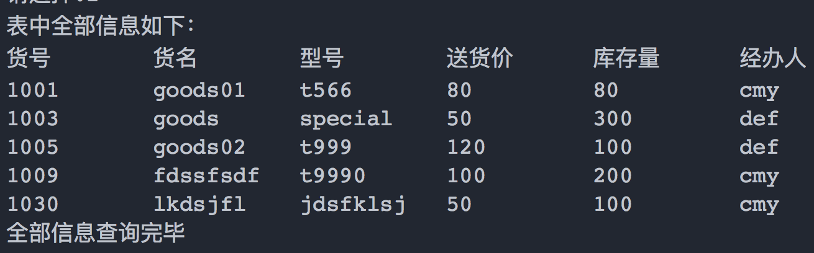
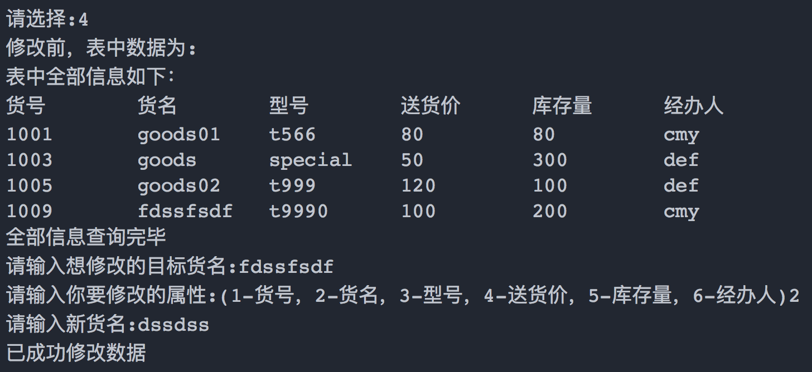
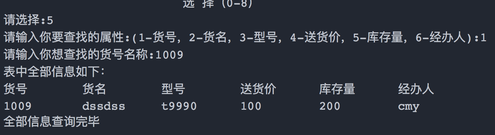
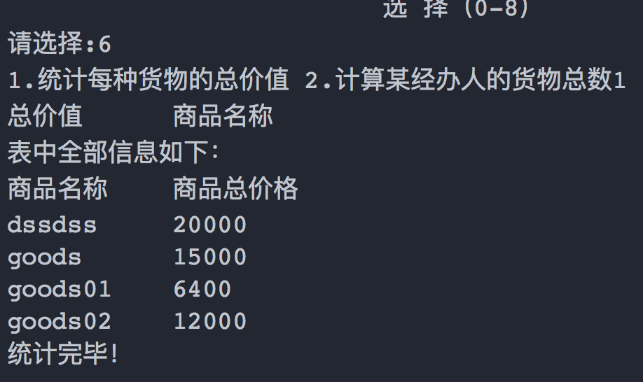
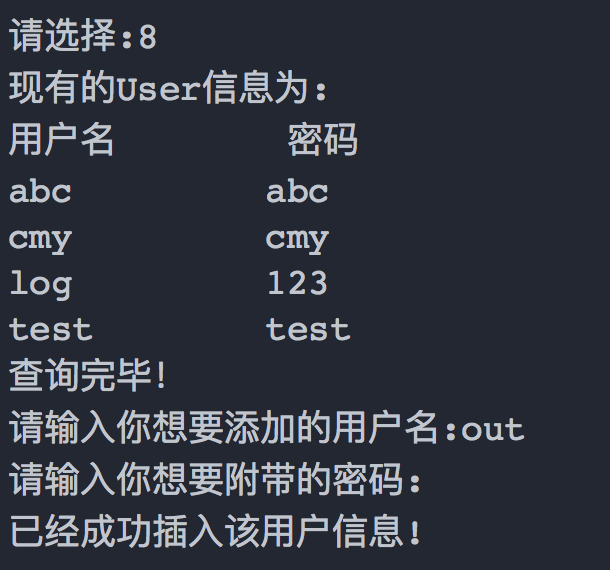

### 超市现存货物管理系统

这是我做的一个基于Python的管理系统，为了方便以后选到该题的大四狗，特地开了这个repo，方便你们进行调试和运行代码。

1. #### 程序所需依赖:

   - Python3
   - V3: 本地sqlite3
   - V4: 本地mysql，增加了生产环境支持和远程连接

   如果对数据库不是很熟的同学，建议选择V3版本，因为sqlite3程序自带，

   仅需下载一个安装包即可，无需配置

   sqlite3下载链接:[Windows版下载](https://www.sqlite.org/2018/sqlite-tools-win32-x86-3240000.zip) [MacOS版下载](https://www.sqlite.org/2018/sqlite-tools-osx-x86-3240000.zip) ，然后按照步骤安装即可。

   mysql下载和配置请参照网上相关步骤

2. #### 如何运行?

   V3版: 安装完所需依赖后，直接进入程序目标文件夹，然后执行python main_v3.py即可（会生成test.db为数据库文件，无需任何操作）

   V4版: 首先安装完所需依赖后，在mysql中：

   1. CREATE DATABASE LEARNSQL; 增加LEARNSQL数据库
   2. 修改main函数中222行的conn属性，配对你自己的host,user,password,db,port，host如果是本地就填localhost
   3. 建议提前建表，具体在程序中已经给出。如果已经建过，程序会自动跳出，不会返回异常放心

3. 程序运行效果:

- 进入普通用户模式，切换为管理员模式

  

  管理员主菜单

  

  增加商品

  

  显示全部商品

  

  删除商品

  

  修改商品

  

  查找特定属性

  

  统计商品

  

  

  添加用户

  

  查询用户信息

  

  退出管理员用户

  

  退出系统

  

  最后，如果需要联系我，请email联系，或者给我提issue。

  最后的最后，愿天堂没有实验周，以及，本人单身🐶，欢迎来撩=_=

